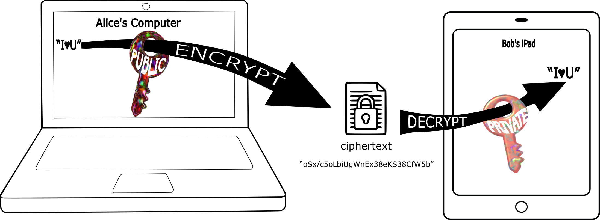
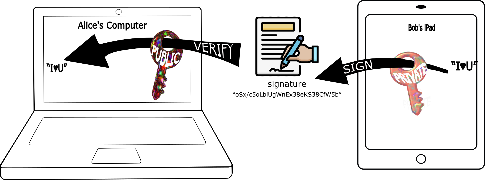
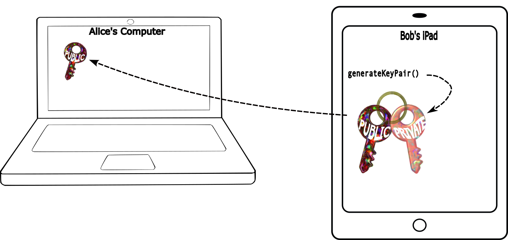

# Distributed Security

This is Javascript browser code that makes it easy for developers to correctly and safely...

1. ... use the four standard cryptographic operations: **encrypt, decrypt, sign, and verify**.
2. ... provide simple and secure **key management** directly to users.

We take advantage of a number of separate APIs that **all modern browsers now support**, combined with a **new approach to key management**. The result is that any Web applications can finally offer the long-promised [benefits of cryptography](lib/whycryptography.md):

- No passwords.
- No tracking by login or viewing of content, including private content.
- A receipt for activity that proves who authorized the activity (by pseudonym), and when.
- Secure attribution for, e.g., posts.
- Faster cloud data access.
- No theft of private content, nor risk to cloud providers that they will be forced to turn over content by threat of violence or legal action.
- All without dependendence on any centralized authority.

While these benefits have been available in some installable apps, desktop browser extensions, and in blockchain, they are now available in ordinary **desktop and mobile web pages** with **zero operating or transaction costs and no browser extensions**.

This README covers:

- [Operations and Tags](#operations-and-tags) 
  - [Crypto Basics](#crypto-basics) - A quick review of the underlying tech, built into browsers and NodeJS.
  - [Distributed-Security Basics](#distributed-security-basics) - The much simpler API for the four basic cryptography operations.
- [Creating Tags and Changing Membership](#creating-tags-and-changing-membership) - Practical key management.
- [Encryption with Multiple Tags and Other Encryption Options](#encryption-with-multiple-tags-and-other-encryption-options)
- [Signatures with Multiple Tags and Other Signature Options](#signatures-with-multiple-tags-and-other-signature-options)
- [Application Use](#application-use)
  - [Library Installation and Declaration](#library-installation-and-declaration)
  - [Storing Keys using the Cloud Storage API](#storing-keys-using-the-cloud-storage-api)
  - [Initialization](#initialization)


We call it "distributed security" because:

- It is security that powers decentralized Web applications.
- Verified information and private information can be securely distributed to [the cloud](https://en.wikipedia.org/wiki/Cloud_computing) and to [p2p networks](https://en.wikipedia.org/wiki/Peer-to-peer_file_sharing).
- Individuals are not represented by a single keypair that can be lost, but are rather distributed over different keypairs for each device used by that individual.
- Arbitrary teams of individuals can have their own keypairs, managed by their members in accordance with the rules of whatever app they are for, with the encrypted keypairs stored in the cloud rather than by any one member of the team.  (In the blockchain community, teams are called [DAO](https://en.wikipedia.org/wiki/Decentralized_autonomous_organization)s.)

Other documents describe [the implementation](docs/implementation.md) and identifies [risks](docs/risks.md) and [remaining work](docs/todo.md).

## Operations and Tags

#### Crypto Basics

[Public-key cryptography](https://en.wikipedia.org/wiki/Public-key_cryptography) uses a related pair of numbers called the publicKey and the privateKey. The privateKey is kept secret by the owner, but the publicKey is made available to everyone.

This allows anyone to encrypt a message so that it can _only_ be read by the holder of the privateKey:

```
mathEncrypt(publicKey, originalData) -> encryptedData
mathDecrypt(privateKey, encryptedData) -> originalData
```


And it allows the holder of a privateKey to sign a message so that anyone can verify that the message they see is unaltered from what was definitely sent by the holder of the privateKey (and absolutely not by anyone else):

```
mathSign(privateKey, data) => signature
mathVerify(publicKey, data, signature) => true if signature was from the exact same data, else false
```


Implementing this requires some pretty amazing math. Browsers now implement these operations, through an API called "SubtleCrypto", so called [because](https://developer.mozilla.org/en-US/docs/Web/API/SubtleCrypto):

> This API provides a number of low-level cryptographic primitives. It's very easy to misuse them, and the pitfalls involved can be very subtle.
> Even assuming you use the basic cryptographic functions correctly, secure key management and overall security system design are extremely hard to get right, and are generally the domain of specialist security experts.
> Errors in security system design and implementation can make the security of the system completely ineffective.

For example, Bob in these pictures has to generate a matching keypair and somehow transfer the public key to Alice.


There are more complications. SubtleCrypto provides a number of different kinds of keys, and of algorithms for performing each of the four operations. The keypair for encrypt/decrypt must be a different keypair than for sign/verify. Text must be converted to particular forms of binary data before it can be operated on.

#### Distributed-Security Basics

**In distributed security, all the various kinds of keys are represented by a single string of characters called a tag.**  The distributed security operators work directly on tags and ordinary Javascript text strings, binary data or objects:

```
encrypt(originalTextOrBinaryOrObject, tag) -> encryptedData
decrypt(encryptedData, tag) -> {payload: originalBinary, text: originalTextOrJSON, json: originalObject}  


sign(originalTextOrBinaryOrObject, tag) -> signature
verify(signature, tag) -> {payload: originalBinary, text: originalTextOrJSON, json: originalObject} 
  
// signature/decryption return undfined if invalid
// text is undefined if original data was binary
// json is undefined if original data was binary or a string
```

All distributed security operations are asynchronous - the call immediately returns a Javascript [Promise](https://developer.mozilla.org/en-US/docs/Web/JavaScript/Guide/Using_promises) that resolves to the specified value.

That's it. The only other operations are for creating, changing, and destroying tags.

## Creating Tags and Changing Membership

To create a new set of keypairs, an application calls `create()`, which returns a promise for a tag.  An application will typically create just one tag for each browser used by an individual, although there is nothing preventing an application from creating more.  When no longer needed (e.g., in respect of the EU [Right to be Forgotten](https://gdpr.eu/right-to-be-forgotten/)), an application can permanently and globally destroy a tag with `destroy(tag)`.

Tags are public, and can be safely shared anywhere. Text can be *encrypted* and *verified* by anyone who has the tag string. For tags made with `create()` (with no arguments), text can only be *decrypted* or *signed* on the browser and device on which the tag was created. The private keys associated with such a tag live only in secure storage on that device, and never leave it.

To use the same identity across all of a user's devices, an application typically creates a tag that is made from all of the browser-specific tags: `create(tag1, tag2, ...)`. We call this kind of tag a "team", whose "members" are the specified tag1, tag2, etc. This team tag is what the application then uses for operations by or for this individual human. The application can add or remove member tags with:

```
changeMembership({
   tag: teamTag,
   add: [tag1, ...], 
   remove: [tag2, ...]
});
```

There can also be teams of individuals (or even of other teams). A team's tag can be used to decrypt, sign, or changeMembership on any computer on which any member was created (or member of a member, etc.). There is no difference between a signature or encrypted ciphertext made from a team of individuals vs a team of browsers. 

An application can create any number of tags. For example, it can create a new tag for each persona or alt of a human, or for each transaction to be signed. Teams can represent a role or authority, or family, workgroup or company.

What happens if you loose access to all your devices at once? No problem! One or more of the member tags of your individual tag can be a "recovery" tag, which is encrypted using the answer to one or more security questions. By calling `createTag({prompt: "some security question"})`, an application can create one or more recovery tags that consist of answers that only you would know (or the concatenation of several answers). The recovery tags are stored (encrypted) in the cloud and are generally not used. But if you attempt to use your individual tag on a device that is not a member of that individual tag, the system will ask the application to ask you your security question(s). The answers will unlock your individual tag only if the answers match what was previously encrypted, allowing you to add new devices and remove the old ones.

## Encryption with Multiple Tags and Other Encryption Options

When something is encrypted with `encrypt(message, tag)`, the only thing that will decrypt it is the private key associated with `tag`. The encryption is made with the public part of a single keypair. The encryption is a string in a standard format called "JOSE [JWE compact serialization](https://datatracker.ietf.org/doc/html/rfc7516#section-7.1)". The tag appears as the JWE *key identifier* ("kid") header, and the *content type* ("cty") header may be defined as described below. The result of a succcessful `decrypt()` is an object that includes a "payload" property containing binary data. If `text` or `json` can be produced based on content type, these are defined as additional properties. If the encryption does not decrypt, the result is falsey (undefined). 

We can also encrypt a message with multiple tags, so that any *one* of the listed tags can decrypt it. The encryption is in a standard format called "JOSE [JWE general serialization](https://datatracker.ietf.org/doc/html/rfc7516#section-7.2.1)" and includes encryptions made with each of the specified keypairs: `encrypt(message, tag1, tag2, tag3)` can be decrypted with just `decrypt(JWE, tag2)` (or tag1, or tag3). 

You can also specify options for the encryption: `encrypt(message, {tags, contentType, time})`, and for decryption: `decrypt(ciphertext, {tag, contentType}`. The `contentType` and `time` appear as "headers" within the JWE (as "cty" and "iat", respectively), which may be useful when interacting with other JOSE systems.

- A contentType that contains the substring "text" will treat the message as a string during encryption, and will produce that same string during decryption.
- A contentType that contains the substring "json" will automatically call `JSON.stringify(message)` and treat that result as a string when encrypting, and call `JSON.parse` on that same string when decrypting.
- The contentType defaults to "text/plain" during encryption if message is of type "string", and to "application/json" if message is of type "object" but not binary (an ArrayBuffer view). (We follow the JOSE standard of identifying "application/json" as just "json" in the "cty" header.) For decryption, the "contentType" defaults to whatever is specified in the JWE as the "cty" header.

> Distributed-Security uses this itself: the way that your tag's keys are available on all your devices is that Distributed-Security encrypts your keys for each member browser that you work on, and stores the encrypted keys in the cloud. Any of your browsers can then decrypt the keys, but not ayone one else who isn't a member of that team. When a Web page that uses Distributed-Security tries to sign or decrypt for your team tag, it pulls your encrypted keys' JWE, and decrypts the keys with the member key that you happen to already have in that browser (and only in that browser). The same happens recursively for more complex teams that you are a member of. 

> (There is a subtle difference between data encrypted by a team tag and a team tag's own private keys. Data encrypted by a team tag is encrypted only by the one or more tags that are explicitly given in the call to encrypt. It is NOT encrypted by the members of those tags. The team's own keys are not encrypted by the team tag -- that would be circular -- but are *instead* encrypted by the list of member tags.)

## Signatures with Multiple Tags and Other Signature Options

When something is signed with `sign(message, tag)`, the only things that will verify it is the public key assocaited with `tag`. The signature is made with the private part of a single keypair. The signature is in a standard format called "JOSE [JWS compact serialization](https://datatracker.ietf.org/doc/html/rfc7515#section-7.1)". The tag appears as the JWE *key identifier* ("kid") header. The JWS may include "cty" and "iat" headers, as defined below. The result of a succcessful `verify()` is an object that includes a "payload" property containing binary data. If `text` or `json` can be produced based on content type, these are defined as additional properties. If the signature does not verify, the result is falsey (undefined). 

We can also sign a message with multiple tags, so that any *one* of the listed tags can verify it. The signature is in a standard formated called "JOSE [JWS General serialization](https://datatracker.ietf.org/doc/html/rfc7515#section-7.2.1)" and includes signatures made with each of the specified keypairs: `sign(message, tag1, tag2, tag3)` can be verified with just `verify(JWS, tag2)` (or tag1, or tag3).  When this JWS is successfully verified, the result additionally contains a "signers" property that has an element for each signature in the JWS. Each signer element is an object that defines "payload" if and only if the corresponding original signature was verfied, and "protectedHeader" that contains the headers attested by the signer, including the individual "kid". 

Additionally, verify can be called with multiple tags (e.g., `verify(JWS, tag1, tag2, tag3)`), and the result is falsey (undefined) if *any* of the specified tags are incorrect in the signature. When multiple tags are given to `verify()`, a successful result includes a `signers` property (in addition to the `payload`, `text` and `json` properties described earlier.) Each element of `signers` corresponds to the signatures of the JWS in order, and may include `protectedHeader`, `header`, and `payload` as appropriate for that particular signer, where `payload` is undefined if that signature was not verified by the tags given to `verify()`. This can be used in an application-specific way to see if the JWS is what was expected.

You can also specify options: `sign(message, {tags, contentType, time, team, member})`, and `verify(ciphertext, {tags, contentType, notBefore, team, member})`. 

- The contentType and time are as for Other Encryption Options, above. 
- If a signature is made with a "team" option that has a tag as value, the JWS contains an issuer header ("iss"), and the specified tag will appear as the first of tags if not already among them. The "tags" option can be omitted.
- If a signature is made with a "member" option that has a tag as value, the JWS contains an actor header ("act"), and the specified tag will be added to the tags if not already among them. The "tags" option can be omitted. If "team" is specified as an option, "member" defaults to a member of that team that belongs to the current user in the current browser.
- If a verification is made with a "member" option that has a value of the string "team", verification will fail if the JWS does not contain "iss" and "act" headers, and if there exists a current version of the issuing team in the cloud that does not list the specfied "act" as a member. (Verification *passes* if "iss" and "act" are specified, but the "iss" team does not yet exist.) "member" defaults to "team" if the JWS contains an "act" header.
- If a verification is made with a truthy "notBefore", verification will fail if the JWS does not contain "iat", or if "iat" is earlier than the specfied "notBefore". If "notBefore" has the value "team", the "iat" cannot be earlier than the "iat" of the issuing team, if the team exists.

> This is used by Distributed-Security itself in protecting the cloud storage that holds encrypted keys. The (encrypted) keys are signed as `sign(key, {team: tag, time})` so that "iss", "act", and "iat" headers are specified. The cloud `store()` operation verifies this by `verify(JWS, {team: tag, notBefore: "team"})`. See below.
## Application Use

### Library Installation and Declaration

The distributed security code is available as a Javascript module:

```
# Installation in terminal:
npm install @kilroy-code/distributed-security
```

For development and local experiments, this module can be imported directly into application Javascript code served at an `https` or `locahost` domain. However, for production use, distributed security prevents keys from being copied or exported by keeping them in a "software vault" that prevents access from [phishing or XSS attacks](docs/risks.md). 

To do this, it is necessary to host the module via `https` at a *different origin* than the rest of the application. (This creates a distinct ["browsing context"](https://developer.mozilla.org/en-US/docs/Glossary/Browsing_context) that isolates the code and data.) For example, an application could be at `store.example.com`, and the distributed-security code could be hosted at `vault.example.com`:

```
import Security from "https://vault.example.com/distributed-security/index.mjs";
```

One can have a set of cooperating applications that all share the same tags, even if the applications themselves are in different domains. For example, different sites named land.metaverse.org, NFTs-R-us.com, and store.com, could all use the same tags by cooperating on a joint source named NFT-keys.org that hosts the distributed-security module for each to share. 

Even when several applications opt-in to use the same URL of the distributed-system module, no such application can copy or export keys, nor can they do any operations on a key that the user is not recursively a member of. However, any application can *use* a key (e.g., have the user sign, decrypt, or change membership of a key) that was created by any of the other applications using the same module URL. Whether this is desirable depends on the application. If you want to prevent this, you can host the distributed system module yourself, _or_ make application-specific keys through `getUserDeviceSecret` (see [Initialization](#initialization), below).


### Storing Keys using the Cloud Storage API

Individuals and teams automatically work across devices because the individual or team's key is stored in the cloud by the application, and made available to everyone. However, the key is encrypted in such a way that it can be [decrypted by any member](docs/implementation.md#3-encrypting-for-members) (and only the members).

**This is the "secret sauce" of distributed security:** Instead of expecting individuals to manage copies of keys or giving unencrypted keys to centralized or third-party "custodians", we arrange things so that:

- Device keys are stored only on the device that created them, in a way that no one can read: not the application (nor by compromised application code), not the authors of distributed security, and not even by the by the users (who might otherwise get phished).
- An individual's keys are stored in the cloud, but the vault encrypts it through a technique that allows it to be decrypted only by one of the member devices, not by the authors of distributed security, not by the application (nor by compromised application code), and not by the cloud.
- Team keys are encrypted to be read only by their members, etc.

There are no custodial copies of device keys, and none are needed. If a device is lost, an individual can still access his individual key in the cloud using his other devices, or by a virtual device made up of security-question answers.

The application must supply a storage object with two methods: 

```
retrieve(collectionName, tag) -> signature
store(collectionName, tag, signature)
```

Applications must supply their own implementation of this storage API, meeting their own application-specific needs. For example, the application could limit storage to paying users. The only requirements imposed by Distributed-Security are:

1. The strings `'Team'` `'KeyRecovery'` and `'EncryptionKey'` must be allowed as the `collectionName` parameters. These are the only cloud storage collectionNames used by distributed security. (The cloud storage may recognize other collection names, but this is not required for distributed security to work.)
2. The `tag` parameter must support arbitrary case-sensitive strings of at least 132 ASCII characters. The tag strings are url-safe base64-encoded.
3. Arbitrarily long text and jsonable payloads must be supported. Teams with N members are less than (N + 5) kbytes. (The cloud storage may support much longer payloads, and unicode text, but this this is not required for distributed security to work.
4. `store(collectionName, tag, signature)` should verify that `Security.verify(signature, {team: tag, notBefore: "team"})` resolves to truthy. (To allow for storage to be P2P within the application, the distributed security module is designed for such mutual co-dependency to not be an infinite loop.) store() can return anything except `undefined`. There is no security need for additional checks, such as access-control-lists or API keys. However, an application is free to make additional checks. For example, using just the minimal requirements, any member could change the composition of their team, and an application might want to either create an audit trail of which member did so, or might want to restrict such changes to a designated "administrator" member. That's up to to the application.(*)
5. Because of the way that payload text is encrypted, there is no security requirement to restrict access for the `retrieve` operation. However, applications are free to impose additional restrictions.


Here is how things play out for an application using the module to sign someText.  

1. The application `sign` request goes to the vault. 
2. The vault then calls the `retrieve` method of the cloud storage API. 
3. The implementation of `retrieve` was supplied by the application to retrieve the opaque key, typically from a cloud-based key-value store.
4. The vault on the user's browser is the only place anywhere that has the device key D1. The vault uses this to decrypt the retrieved key I1. 
5. The vault then uses the decrypted I1 keys to sign `someText` and return it to the application.

```
     computing device D1 belonging to individual I1                        cloud
+----------------------------------------------------+             +-------------------------+
|    app/page                            vault       |             |                         |                      
| store.example.com                vault.example.com |             |   key(I1, {D1, D7))     |
| +-----------+                       +------------+ |             |    is key(I1) encrypted |
| |           |                       | key(D1)    | |             |    for only D1 or D7 to |
| |           |                       |            | |             |    read                 |
| |           |   sign(I1, someText)  |            | |             |                         |
| |   1.START |--------------------->>|            | |             |                         |
| |           |                       |            | |             |                         |
| |           |                       |          2.| retrieve('key', I1)                     |
| |           |                       |            |------------->>|                         |
| |           |                       |            |               |                         |       
| |           |                       |            | key(I1, {D1, D7})  3.                   |
| |           |                       |            |<<-------------|                         |
| |           |                      4. use key(D1)| |             |                         |
| |           |                       |  to decrypt| |             |                         |
| |           |                     key(I1, {D1, D7})|             |   there are other keys  |
| |           |                       |            | |             |  here in the cloud, too |
| |           |                    5. sign someText| |             |                         |
| |           |                       |  w/ key(I1)| |             |                         |
| |           |                       |            | |             |                         |
| |     END   |signature(I1, someText)|            | |             |                         |
| |           |<<---------------------|            | |             |                         |
| +-----------+                       +------------+ |             |                         |
+----------------------------------------------------+             +-------------------------+
```


### Initialization

The secruity module must be initialized as follows:

```
Security.Storage = aCloudStorageImplmentationThatImplementsStoreAndRetrieve;
Security.getUserDeviceSecret = aFunctionOf(tag, optionalPrompt); // See below
await Security.ready; // Resolves to the module name and version when ready to use.
```
The `getUserDeviceSecret` is used as an additional layer of defense in case an attacker is able to gain access to the device vault storage (perhaps through an [application or browser bug](docs/risks.md)). The string returned by this function is used as a secret to encrypt device keys within the vault. At minumum, it must return the same string when given the same tag, for the same user on the same device. It is best if the string that is always returned is different for different devices, and different for different users on the same device (e.g., if  the same device is used by multiple human users). For example, it could be the hash of the concatenation of tag, username, and device tracking cookie if the cookie is reliable enough. `getUserDeviceSecret` can be gated on any facial recognition, MFA, or the Web Credential Management API to make use of hardware keys, authenticators, etc.

When the user creates a recovery tag, the application's `getUserDeviceSecret` is called with the same prompt identifier that had earlier been given to `create({prompt})`. The prompt is stored (unencrypted) with the resulting (encrypted) keys in the cloud. If the user later tries to (recursively) access the resulting recovery tag in any browser, the application's `getUserDeviceSecret(tag, prompt)` is called again, and result must be identical to what was returned when the recovery key was created.

It is recommended that the size of the string producted by getUserDeviceSecret should be between 16 and 128 characters.

`getUserDeviceSecret` can be used as a mechanism for additional distinctions. For example, suppose a group of cooperating applications want to be able to encrypt and verify a common set of tags among all uses of a shared module URL. (See [Library](#library), above.) But suppose further that, for whatever reason, they wanted each application to create a different application-specific device tag, such that no application could ask the user to sign or decrypt ultimately based solely on a different application's member device tag. In this case, an application could request an application-specific (and possibly user-specific) api-key from its own application-server, and use that api-key within the secret returned by `getUserDeviceSecret`. This would keep device keys from being used by other applications that shared the same vault. (However, it would not by itself prevent a user that has access to _both_ application's device keys from making a single "individual" key that has both application-specific keys as members. Preventing that would require additional mechanisms within the application-provided Storage API.)
